### Hey there 

I’m Bhupendra Singh Negi

🔭 I’m currently working with @Clearstack, Bangalore as Software Developer.

👨🏾‍💻 Languages I love to code in
  * Ruby
  * Javascript
  * C++
  * Python
  * Java
  
📫 How to reach me:

<!---
BhupendraNegi/BhupendraNegi is a ✨ special ✨ repository because its `README.md` (this file) appears on your GitHub profile.
You can click the Preview link to take a look at your changes.
--->
